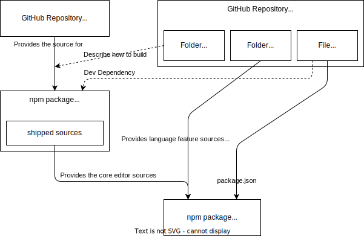
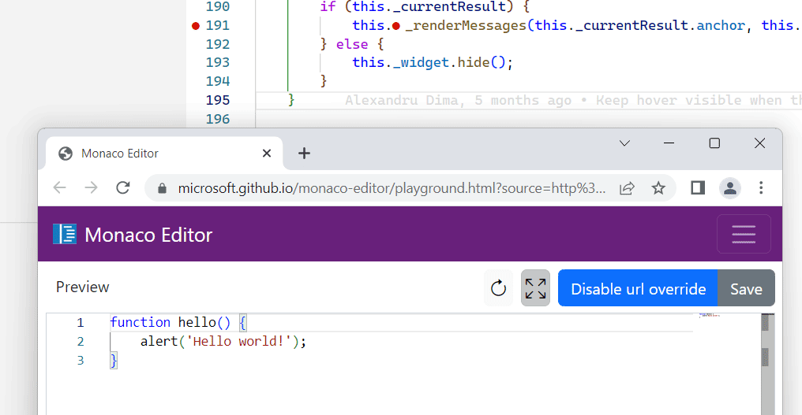
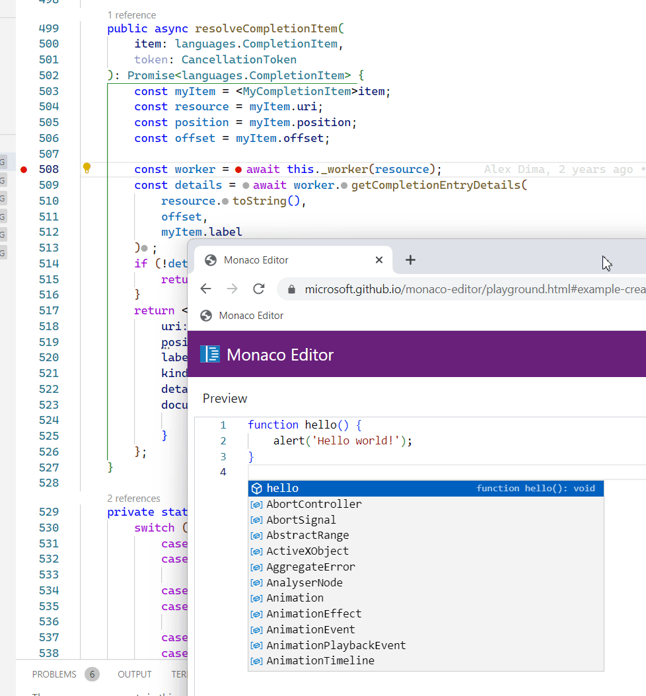
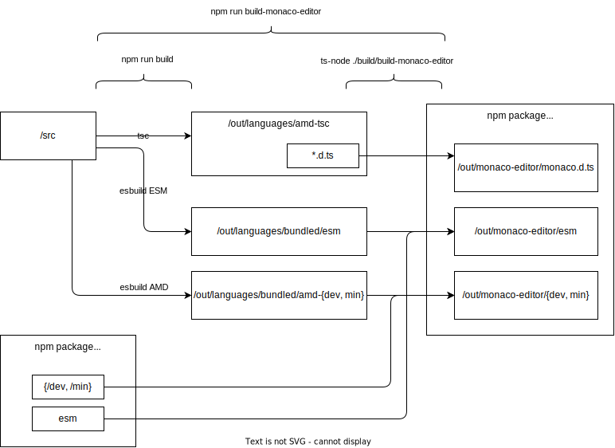

# Contributing / Dev Setup

## Source Code Structure

It is important to understand that the Monaco Editor _Core_ is built directly from the [VS Code source code](https://github.com/microsoft/vscode).
The Monaco Editor then enhances the Monaco Editor Core with some basic language features.

This diagram describes the relationships between the repositories and the npm packages:



By default, `monaco-editor-core` is installed from npm (through the initial `npm install`), so you can work on Monaco Editor language features without having to build the core editor / VS Code.
The nightly builds build a fresh version of `monaco-editor-core` from the `main` branch of VS Code.
For a stable release, the commit specified in `vscodeRef` in [package.json](./package.json) specifies the commit of VS Code that is used to build `monaco-editor-core`.

## Contributing a new tokenizer / a new language

Please understand that we only bundle languages with the monaco editor that have a significant relevance (for example, those that have an article in Wikipedia).

- create `$/src/basic-languages/{myLang}/{myLang}.contribution.ts`
- create `$/src/basic-languages/{myLang}/{myLang}.ts`
- create `$/src/basic-languages/{myLang}/{myLang}.test.ts`
- edit `$/src/basic-languages/monaco.contribution.ts` and register your new language
- create `$/website/index/samples/sample.{myLang}.txt`

```js
import './{myLang}/{myLang}.contribution';
```

## Debugging / Developing The Core Editor

To debug core editor issues.

This can be done directly from the VS Code repository and does not involve the monaco editor repository.

- Clone the [VS Code repository](https://github.com/microsoft/vscode): `git clone https://github.com/microsoft/vscode`
- Open the repository in VS Code: `code vscode`
- Run `yarn install`
- Select and run the launch configuration "Monaco Editor Playground" (this might take a while, as it compiles the sources):

  

- Now you can set breakpoints and change the source code

  

- Optionally, you can build `monaco-editor-core` and link it to the monaco editor repository:

  ```bash
  # builds out-monaco-editor-core
  > yarn gulp editor-distro

  > cd out-monaco-editor-core
  > npm link
  > cd ../path/to/monaco-editor

  # symlinks the monaco-editor-core package to the out-monaco-editor-core folder we just built
  > npm link monaco-editor-core
  ```

## Debugging / Developing Language Support

To debug bundled languages, such as JSON, HTML or TypeScript/JavaScript.

- Clone the [monaco editor repository](https://github.com/microsoft/monaco-editor): `git clone https://github.com/microsoft/monaco-editor`
- Open the repository in VS Code: `code monaco-editor`
- Run `npm install`
- Select and run the launch configuration "Monaco Editor Playground" (this might take a while, as it compiles the sources):

  

- Now you can set breakpoints and change the source code

  

- Optionally, you can build `monaco-editor` and link it if you want to test your changes in a real application:

  ```bash
  # builds out/monaco-editor
  > npm run build-monaco-editor

  > cd out/monaco-editor
  > npm link

  > cd ../path/to/my-app
  > npm link monaco-editor
  ```

## Running the editor tests

```bash
> npm run build-monaco-editor
> npm run test
> npm run compile --prefix webpack-plugin

> npm run package-for-smoketest-webpack
> npm run package-for-smoketest-esbuild
> npm run package-for-smoketest-vite
> npm run package-for-smoketest-parcel --prefix test/smoke/parcel
> npm run smoketest-debug
```

## Running the website locally

```bash
> yarn install
> yarn build-monaco-editor

> cd website
> yarn install
> yarn typedoc
> yarn dev 
```

Now webpack logs the path to the website.

## Out Folders

This diagram describes the output folders of the build process:



## Maintaining

Checkout [MAINTAINING.md](./MAINTAINING.md) for common maintaining tasks (for maintainers only).
